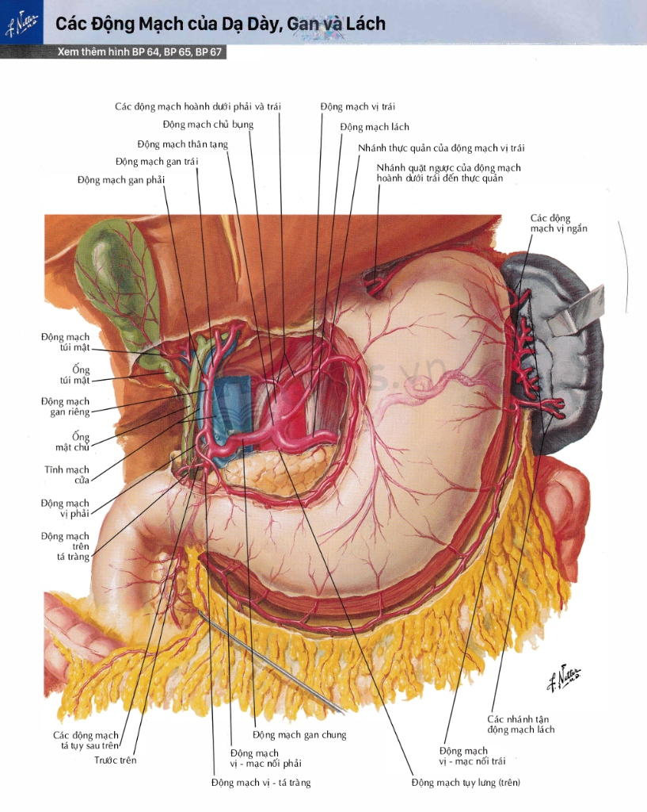

# AnatoVi3D 🫀🧠🦴

**AnatoVi3D** là ứng dụng tương tác 3D trực quan hóa giải phẫu học cơ thể người bằng tiếng Việt, kết hợp các chuyên đề bài giảng chuyên sâu chuẩn mực theo các bộ bản đồ giải phẫu kinh điển thế giới (Frank H. Netter MD).

---

## ✨ Điểm Nổi Bật

- **Mô Hình 3D Toàn Diện Đa Hệ Cơ Quan**:
  - Hệ Xương (*Skeletal System*) & Khớp (*Joints*)
  - Hệ Cơ (*Muscular System*)
  - Hệ Tim Mạch (*Cardiovascular System* - Động mạch & Tĩnh mạch)
  - Hệ Thần Kinh (*Nervous System*)
  - Hệ Nội Tạng (*Visceral Organs* - Tiêu hóa, Hô hấp, Tiết niệu)

- **Bài Giảng Chuyên Đề 3D Chuyên Sâu (#01 - Thân Động Mạch Tạng & Tầng Trên Mạc Treo)**:
  - Tái dựng 3D chuẩn xác theo **Frank H. Netter MD (Plate BP 64)**:
    - Bộc lộ tư thế vén gan phẫu tích (*Surgical Liver Retraction*).
    - Khép kín và bảo toàn nguyên vẹn 100% thanh mạc dạ dày (*Gastric Serosa*).
    - Cung mạch vòng bờ cong nhỏ (*Lesser curvature arcade*) và vòng bờ cong lớn (*Greater curvature arcade*).
    - 6 nhánh thẳng xuyên thành (*Rami gastrici*) tỏa lên mặt trước thân vị.
    - Chùm 5 động mạch vị ngắn (*Short gastric arteries*) tỏa lên vòm đáy vị.
    - Động mạch lách (*Splenic artery*) uốn lượn ngoằn ngoèo đặc trưng dọc bờ trên thân và đuôi tụy sau phúc mạc.
    - Tam giác Calot (Túi mật & ĐM túi mật) và bộ ba cuống gan (*Portal Triad*).
  - **Chế độ tương tác học tập thông minh**:
    - **🎨 Góc Nhìn Netter**: Tự động chuyển camera về góc phối cảnh tranh gốc Netter BP 64.
    - **Chế độ X-Ray**: Làm mờ dạ dày/gan để quan sát rõ tụy, ống tụy và giường dạ dày phía sau.
    - **Chế độ Chỉ Xem Mạch Máu (Arteries Solo)**: Bóc tách riêng biệt cây động mạch 3 chiều.
    - **Cận cảnh & Đọc phát âm**: Tự động lia camera và phát âm chuẩn danh pháp giải phẫu quốc tế (Terminologia Anatomica).

- **Kiến Thức Lâm Sàng & Ngoại Khoa**:
  - Tích hợp bản đồ chặng hạch nạo vét ung thư dạ dày **JGCA (D1, D2)**.
  - Cơ chế vi tuần hoàn xuyên thành dạ dày và giải phẫu ứng dụng hậu cung mạc nối (*Bursa omentalis*).
  - Các mốc thắt mạch ngoại khoa và cấp cứu xuất huyết loét thủng tá tràng (ĐM vị - tá tràng).

---

## 🚀 Hướng Dẫn Chạy Cục Bộ (Local Setup)

### Yêu Cầu
- Trình duyệt web hiện đại hỗ trợ WebGL (Chrome, Edge, Firefox, Brave, Safari).
- Python 3.x (để chạy server tĩnh).

### Khởi Động Nhanh

1. **Clone repository**:
   `ash
   git clone https://github.com/jeznopro/AnatoVi3D.git
   cd AnatoVi3D
   `

2. **Khởi động server**:
   - Trên **Windows**: Nhấp đúp vào file Chay_App.bat (hoặc start.bat).
   - Hoặc chạy lệnh qua terminal:
     `ash
     python server.py
     `
     *(hoặc python -m http.server 8000)*

3. **Mở trình duyệt**:
   Truy cập http://localhost:8000 hoặc cổng được hiển thị trong terminal.

---

## 📁 Cấu Trúc Thư Mục

`
AnatoVi3D/
├── index.html            # Giao diện chính của ứng dụng và modal bài giảng
├── app.js                # Logic tương tác 3D Three.js, camera, shader & bài giảng
├── server.py             # Server tĩnh Python hỗ trợ CORS và cache-control
├── Chay_App.bat          # File khởi động nhanh một chạm cho Windows
├── assets/               # Hình ảnh giao diện, atlas, tranh Netter gốc
├── data/                 # Cơ sở dữ liệu giải phẫu và danh pháp y khoa
├── libs/                 # Thư viện Three.js, OrbitControls, GLTFLoader
└── models/               # Mô hình 3D GLTF/GLB đa tầng giải phẫu
`

---

## 🛠️ Công Nghệ Sử Dụng

- **Three.js** (WebGL 3D Rendering Engine)
- **Git LFS** (Large File Storage cho mô hình 3D dung lượng cao)
- **Vanilla JavaScript & Modern CSS** (Hiệu năng cao, không phụ thuộc nặng framework)
- **Web Audio & Web Speech API** (Đọc phát âm danh pháp giải phẫu học)
- **Chuẩn Danh Pháp**: Terminologia Anatomica (Latin - Tiếng Việt)
